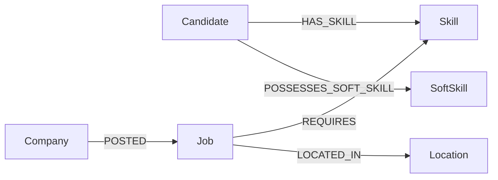

# Talent Intelligence Hub

Plateforme de matching candidat/job orientee graphe + IA : recommandations lexicales et semantiques, gouvernance data, analytics Neo4j, et workflow RH assiste (CV/GitHub/entretien).

## Stack technique


## Architecture rapide

- Backend: API REST Spring Boot + Spring Data Neo4j + Neo4jClient pour les requetes Cypher analytiques.
- Frontend: Angular standalone components + RxJS + D3.js pour visualisation graphe.
- IA/ML: Groq (extraction/generation), embeddings locaux DJL (384 dimensions), recherche vectorielle Neo4j.
- Gouvernance: normalisation/canonicalisation des skills, quality audit, data funnel et drift proxy.

## Schema de donnees graphe et volumetrie

Le graphe metier tourne a grande echelle avec:

- plus de 1 000 000 de noeuds
- environ 4 300 000 relations

Schema logique principal (rendu graphe GitHub Mermaid):



Proprietes principales:

- Candidate: `id`, `name`, `email`, `resumePath`
- Skill: `id`, `name`, `embedding[384]`
- Job: `job_link`, `title`, `type`, `level`
- SoftSkill: `id`, `name`
- POSSESSES_SOFT_SKILL: `confidence`, `evidence`, `source`, `updatedAtEpochMs`

Relations cles exploitees par les modules IA/analytics:

- matching lexical: overlap `HAS_SKILL` vs `REQUIRES`
- matching semantique: voisinage vectoriel `Skill.embedding`
- career path: transitions multi-hop skills -> jobs
- behavioral AI: relation explicable `POSSESSES_SOFT_SKILL`

[👉 Documentation technique complete de l'architecture et de tous les modules](details_fonctionnalites.md#documentation-technique-complete)

## Preprocessing data et transformation embeddings

### Pipeline de preprocessing (datasets bruts -> fichiers Neo4j)

Le script [fix data/process_neo4j_data.py](fix%20data/process_neo4j_data.py) prepare les donnees avant import:

1. Echantillonnage controle de 200 000 jobs depuis `linkedin_job_postings.csv`.
2. Filtrage des skills uniquement sur ce sous-ensemble de jobs.
3. Explosion `job_skills` (1 ligne = 1 skill) puis nettoyage.
4. Normalisation stricte des skills (minuscule + suppression caracteres non alphanumeriques) pour reduire les doublons.
5. Traitement des summaries en chunks de 50 000 lignes pour limiter la RAM.

Sorties generees dans [data](data):

- `neo4j_jobs_200k.csv`
- `neo4j_skills_relations_200k.csv`
- `neo4j_summaries_200k.csv`

Execution:

```bash
python "fix data/process_neo4j_data.py"
```

### Modele d'embeddings utilise

Le projet utilise `sentence-transformers/all-MiniLM-L6-v2` avec vecteurs 384 dimensions et normalisation cosine:

- runtime backend: config `skills.embedding.model-id` + `skills.embedding.dimension=384` dans [backend/src/main/resources/application.properties](backend/src/main/resources/application.properties)
- migration batch massive: script [scripts/migrate_skill_embeddings.py](scripts/migrate_skill_embeddings.py)

Dependances batch embeddings: [scripts/requirements-embeddings.txt](scripts/requirements-embeddings.txt)

```bash
pip install -r scripts/requirements-embeddings.txt
python scripts/migrate_skill_embeddings.py --password "$NEO4J_PASSWORD"
```

### Infos techniques necessaires pour reproduire

- Neo4j actif sur `bolt://127.0.0.1:7687`
- variables d'environnement recommandees:
	- `NEO4J_USERNAME`
	- `NEO4J_PASSWORD`
	- `GROQ_API_KEY`
	- `GITHUB_TOKEN`
- index vectoriel Neo4j: `skill_embedding_index` (cosine, 384D), gere automatiquement par le backend
- gouvernance skills: normalisation + canonicalisation alias avant ecriture Neo4j

## Fonctionnalites majeures

### 1) Dashboard global et sante des donnees

Le dashboard centralise les KPIs globaux (jobs, skills, candidats) et l'etat de sante de la base. Il combine monitoring produit et lecture metier en une vue unique.

[👉 Voir les details techniques de cette fonctionnalite](details_fonctionnalites.md#dashboard-et-observabilite)

### 2) Coverage Funnel (Big Data Governance)

Le funnel montre le passage du volume brut de skills au signal utile partage entre marche et candidats. Il met en evidence la couverture effective des competences.

[👉 Voir les details techniques de cette fonctionnalite](details_fonctionnalites.md#coverage-funnel-et-gouvernance)

### 3) Data Drift Proxy

Le drift est estime via concentration des top skills et entropie des distributions niveau/type. Cela permet un signal risque meme sans historique temporel complet.

[👉 Voir les details techniques de cette fonctionnalite](details_fonctionnalites.md#data-drift-proxy)

### 4) Graph Centrality et Skill Communities

Les skills leviers et communautes de co-occurrence sont extraits du graphe Job-Skill. Cette vue identifie les competences pivot du marche.

[👉 Voir les details techniques de cette fonctionnalite](details_fonctionnalites.md#graph-analytics-centralite-et-communautes)

### 5) Gestion des candidats

La liste candidats expose score de qualite/signal et actions rapides (profil, recommandations, graphe). La creation supporte recherche dynamique de competences.


[👉 Voir les details techniques de cette fonctionnalite](details_fonctionnalites.md#gestion-des-candidats-et-skills)

### 6) Resume & Portfolio Intelligence (CV + GitHub)

Le module extrait les skills du CV, detecte GitHub, calcule un delta (validated/claimed/hidden gems), puis permet une validation humaine avant ecriture Neo4j.

[👉 Voir les details techniques de cette fonctionnalite](details_fonctionnalites.md#resume-et-portfolio-intelligence)

### 7) Profil comportemental (soft skills)

Les soft skills sont inferees a partir de signaux CV/GitHub avec preuves explicables et score de confiance, puis ajoutables au profil candidat.

[👉 Voir les details techniques de cette fonctionnalite](details_fonctionnalites.md#profil-comportemental-soft-skills)

### 8) Dynamic Interview Generator

Generation asynchrone de questions d'entretien senior ciblees sur les zones "Claimed but Unverified", avec fallback intelligent en cas d'indisponibilite upstream.

[👉 Voir les details techniques de cette fonctionnalite](details_fonctionnalites.md#dynamic-interview-generator)

### 9) Recommandations elargies (semantic matching)
.png>)
Le matching vectoriel propose des jobs pertinents avec score semantique et explication skill-a-skill pour une meilleure interpretabilite cote recruteur.

[👉 Voir les details techniques de cette fonctionnalite](details_fonctionnalites.md#recommandations-semantiques-et-explicabilite)

### 10) Graphe candidat-competences-jobs

Visualisation interactive D3 du voisinage candidat/skills/jobs afin d'explorer rapidement les connexions et opportunites.

[👉 Voir les details techniques de cette fonctionnalite](details_fonctionnalites.md#visualisation-graphe-d3)

### 11) Skill Semantic Analyzer

Recherche guidée de skill source avec suggestions dynamiques. L'ecran de resultat affiche les voisins semantiques et leur score de similarite.


[👉 Voir les details techniques de cette fonctionnalite](details_fonctionnalites.md#skill-semantic-analyzer)

### 12) Gestion des jobs et filtrage

La gestion des offres couvre listing, edition, suppression et filtrage multi-criteres (titre, niveau, competence), avec support de recherche full-text.


[👉 Voir les details techniques de cette fonctionnalite](details_fonctionnalites.md#gestion-des-jobs-et-recherche)

### 13) Smart Job Creator (Magic Fill)

L'utilisateur colle une description brute. L'IA propose un pre-remplissage structure et explique chaque champ via des evidences textuelles.


[👉 Voir les details techniques de cette fonctionnalite](details_fonctionnalites.md#smart-job-creator-magic-fill)

### 14) Skill-Gap Roadmap, Career Predictor et parcours multi-hop
.png>)
La roadmap priorise les competences a ajouter selon l'impact marche. Le predictor ajoute un coaching narratif, et les parcours multi-hop proposent des trajectoires vers des jobs cibles.

.png>)


[👉 Voir les details techniques de cette fonctionnalite](details_fonctionnalites.md#roadmap-skill-gap-et-career-path-predictor)

### 15) Captures complementaires (vue complete de l'application)

Vue profil candidat avec synthese des informations metier et statistiques graphe personnalisees.


Detail visuel des distributions de marche utilisees dans la partie gouvernance et pilotage RH.


Classement des competences les plus demandees, exploite pour les analyses d'impact et de priorisation.


Mode simulation en contexte candidat: recommandations, compatibilite et apercu graphe unifie.

[👉 Voir les details techniques de cette fonctionnalite](details_fonctionnalites.md#annexe-visuelle-complete-screenshots)

## Lancement local

### Backend (Spring Boot)
```bash
cd backend
./mvnw spring-boot:run
```

### Frontend (Angular)
```bash
cd frontend-job-recommender
npm install
npm start
```

Frontend: http://localhost:4200  
Backend API: http://localhost:8080/api

## Footer

« Ce projet est un POC (Proof of Concept) réalisé dans le cadre du projet du module Big Data. »
Auteur : Chergui Yassir
